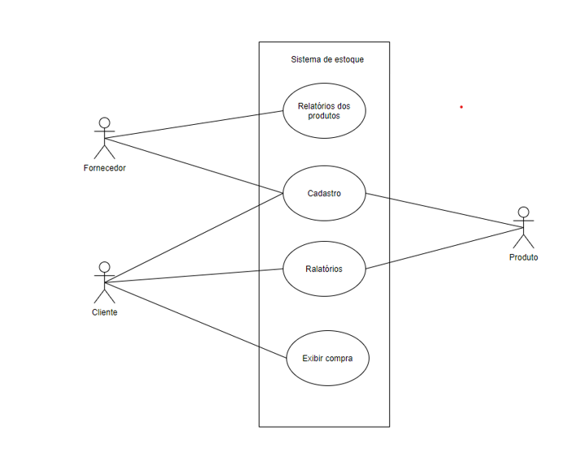

# Sistema de gerenciamento de estoque


Sistema de gerenciamento de estique, que visa os seguintes objetivos: 

* O sistema deve possibilitar o cadastro de clientes, fornecedores e produtos.
* O sistema deve exibir relatórios de clientes, fornecedores e produtos.
* O sistema deve exibir um relatório com todos os produtos de um fornecedor.
* O sistema deve exibir uma compra feita por um cliente, calculando o valor total da compra mediante a quantidade de produtos comprados.
 
# Sumário
- [Página do projeto](https://github.com/Rocky-WP/Rocky-WP.github.io)

- [Sobre](#sobre)

- [Relatórios](#relatorios)

- [Diagrama de classe](#diagrama-de-classe)

- [Diagramas de caso de uso](#diagramas-de-caso-de-uso)

- [Diagrama de caso de uso completo](#diagramas-de-caso-de-uso-completo)

 - [Implemetação](#implementação)


- [Telas do sistema em uso](#telas-do-sistema-em-uso)
  

# Relatórios

## Diagrama de classe


## Sobre
* Interface onde vai concentrar todos os outros atributos.
* Exibe_Relatório, onde vai estar os relatorios dos produtos do fornecedor
* Calcular_compra_cliente, Onde se vai ter o calculo baseado na valor quantidade comprada pelo cliente
* Cadastro_Cliente, onde os clientes vão estar cadastrados
* Cadastro_Produto, onde se vai cadastrar os produtos dos fornecedores
* Cadastrar_ Fornecedor, onde vai estar os fornecedores cadastrados
* Cadastro_Fornecedor, Onde os fornecedores vão estar cadastrados

## Diagramas de caso de uso


## Sobre
* Sistema de estoque, sendo a interface geral
* Fornecedor, pode buscar os relatorios e obter o cadastro
* Cliente, pode se cadastrar exibir os relatorios e exibir as compras 
* Produto, pode se cadastrar  e  mostrar os relatorios

## Diagramas de caso de uso completo


## Sobre
* Cadastrar Fornecedor, pode se cadastrar, excluir e editar
* Cadatrar Cliente, pode se cadastra, excluir e editar
* Cadastar Produto, pode se cadastar, excluir e editar
* Relatórios de produtos, podendo exibi-los
* Calcular compra, calcular a comrpa feita pelo cliente baseado no preço e quantidade


# Implementação

## TelaInicial.html
```html

<!DOCTYPE html>
<html lang="pt-br">
<head>
    <meta charset="UTF-8">
    <meta http-equiv="X-UA-Compatible" content="IE=edge">
    <meta name="viewport" content="width=device-width, initial-scale=1.0">
    <link rel='stylesheet' type='text/css' media='screen' href='TelaInicial.css'>
    <title>Tela Inicial</title>
</head>
<body>
    <h1>Gerenciamento de Estoque e compra!</h1>
    <div id="botoes">
        <a href=http://127.0.0.1:5500/Gerenciamento%20estoque/Cliente.html><button>Cadastrar Cliente </button></a>
        <a href=http://127.0.0.1:5500/Gerenciamento%20estoque/Produtos.html><button>Cadastrar Produto </button></a>
        <a href=http://127.0.0.1:5500/Gerenciamento%20estoque/Fornecedor.html><button>Cadastra Fornecedor </button></a>
        <a href=http://127.0.0.1:5500/Gerenciamento%20estoque/RelatorioProdutos.html><button>Relatorio Fornecedor </button></a>
        <a href=http://127.0.0.1:5500/Controle-de-estoque/CalcularCompra.html><button>Calcular Compra </button></a>

    </div>
</body>
</html>
```


## CalcularCompra.js
```js
let btnEnviar = document.querySelectorAll('#botoes button')[0];
let btnExcluir = document.querySelectorAll('#botoes button')[2];
let btnEditar = document.querySelectorAll('#botoes button')[1];

let nome = document.querySelectorAll('#wrap input')[0];
let quantidade = document.querySelectorAll('#wrap input')[1];
let preco = document.querySelectorAll('#wrap input')[2];


let tabela = document.querySelector('#saida table');
let BD = [];

//métodos
btnEnviar.onclick = function(){
    let produto = new Object();
    produto.nome = nome.value;
    produto.quantidade = quantidade.value;
    produto.preco = preco.value * quantidade.value;
    
   
   
    produto.id = BD.length;
    BD.push(produto);
    tabela.innerHTML += `<tr><td><input type="checkbox" id="${produto.id}" onchange="verificar(this.id)"></td><td>${produto.nome}</td><td>${produto.quantidade}</td><td>${preco.value}</td></tr>`;
}

btnExcluir.onclick = function(){
    for (let i = 0; i < BD.length; i++){
        let elemento = document.querySelectorAll('#saida table tr td input')[i];
        if (elemento.checked){
            BD.splice(elemento.id, 1);
            tabela.innerHTML = `<tr><td width="30px"></td><td>Produto</td>.</td><td>Preço</td></tr>`;
            montarTabela();
        }
    }
}

function montarTabela(){
    for (let i = 0; i < BD.length; i++){
        tabela.innerHTML += `<tr><td width="30px"><input type="checkbox" id="${i}" onchange="verificar()"></td><td>${BD[i].nome}</td><td>${BD[i].quantidade}</td><td>${BD[i].preco}</td></tr>`;
    }
}

btnEditar.onclick = function(){
    for (let i = 0; i < BD.length; i++){
        let elemento = document.querySelectorAll('#saida table tr td input')[i];
        if (elemento.checked){
            BD[i].nome = nome.value;
            BD[i].quantidade = quantidade.value;
            BD[i].preco = preco.value;

            tabela.innerHTML = `<tr><td width="30px"></td><td>Produto</td><td>Quantidade</td><td>Total Compra</td></tr>`;
            montarTabela()
        }
    }    
}

function verificar(id){
    let cont = 0;
    for (let i = 0; i < BD.length; i++){
        let elemento = document.querySelectorAll('#saida table tr td input')[i];
        if (elemento.checked){
            nome.value = BD[i].nome;
            quantidade.value = BD[i].quantidade;
            preco.value = BD[i].preco;
          
    

            cont++;
            if (cont > 1){
                alert('Não é possível selecionar mais de 1 elemento.');
                elemento.checked = false;
                break;
            }
        }
    }
}
```

## Cliente.js

```js
let btnEnviar = document.querySelectorAll('#botoes button')[0];
let btnExcluir = document.querySelectorAll('#botoes button')[1];
let btnEditar = document.querySelectorAll('#botoes button')[2];

let nome = document.querySelectorAll('#wrap input')[0];
let quantidade = document.querySelectorAll('#wrap input')[1];
let preco = document.querySelectorAll('#wrap input')[2];
     
let prateleira = document.querySelectorAll('#wrap input')[3];
let descricao = document.querySelectorAll('#wrap input')[4];
let categoria = document.querySelectorAll('#wrap input')[5];

let tabela = document.querySelector('#saida table');
let BD = [];

//métodos
btnEnviar.onclick = function(){
    let produto = new Object();
    produto.nome = nome.value;
    produto.quantidade = quantidade.value;
    produto.preco = preco.value;
    produto.prateleira = prateleira.value;
    produto.descricao = descricao.value;
    produto.categoria = categoria.value;
    produto.id = BD.length;
    BD.push(produto);
    tabela.innerHTML += `<tr><td><input type="checkbox" id="${produto.id}" onchange="verificar(this.id)"></td><td>${produto.nome}</td><td>${produto.quantidade}</td><td>${preco.value}</td><td>${produto.prateleira}</td><td>${ produto.descricao}</td><td>${produto.categoria}</td></tr>`;
}

btnExcluir.onclick = function(){
    for (let i = 0; i < BD.length; i++){
        let elemento = document.querySelectorAll('#saida table tr td input')[i];
        if (elemento.checked){
            BD.splice(elemento.id, 1);
            tabela.innerHTML = `<tr><td width="40px"></td><td>Nome</td><td>.</td><td>Preço</td><td>Contato</td><td>Endereço</td><td>Núemro casa</td></tr>`;
            montarTabela();
        }
    }
}

function montarTabela(){
    for (let i = 0; i < BD.length; i++){
    }
}

btnEditar.onclick = function(){
    for (let i = 0; i < BD.length; i++){
        let elemento = document.querySelectorAll('#saida table tr td input')[i];
        if (elemento.checked){
            BD[i].nome = nome.value;
            BD[i].quantidade = quantidade.value;
            BD[i].preco = preco.value;

            BD[i].prateleira = prateleira.value;
            BD[i].descricao = descricao.value;
            BD[i].categoria = categoria.value;

            tabela.innerHTML = `<tr><td width="40px"></td><td>Nome</td><td>Quant.</td><td>Preço</td></td><td>prateleira</td></td><td>descricao</td></td><td>categoria</td></tr>`;
            montarTabela();
        }
    }    
}

function verificar(id){
    let cont = 0;
    for (let i = 0; i < BD.length; i++){
        let elemento = document.querySelectorAll('#saida table tr td input')[i];
        if (elemento.checked){
            nome.value = BD[i].nome;
            quantidade.value = BD[i].quantidade;
            preco.value = BD[i].preco;
            prateleira.value = BD[i].prateleira;
            descricao.value = BD[i].descricao;
            categoria.value = BD[i].categoria;

            cont++;
            if (cont > 1){
                alert('Não é possível selecionar mais de 1 elemento.');
                elemento.checked = false;
                break;
            }
        }
    }
}

```

## Fornecedor.js

```js

let btnEnviar = document.querySelectorAll('#botoes button')[0];
let btnExcluir = document.querySelectorAll('#botoes button')[1];
let btnEditar = document.querySelectorAll('#botoes button')[2];

let nome = document.querySelectorAll('#wrap input')[0];
let quantidade = document.querySelectorAll('#wrap input')[1];
let preco = document.querySelectorAll('#wrap input')[2];
     
let prateleira = document.querySelectorAll('#wrap input')[3];
let descricao = document.querySelectorAll('#wrap input')[4];
let categoria = document.querySelectorAll('#wrap input')[5];

let tabela = document.querySelector('#saida table');
let BD = [];

//métodos
btnEnviar.onclick = function(){
    let produto = new Object();
    produto.nome = nome.value;
    produto.quantidade = quantidade.value;
    produto.preco = preco.value;
    produto.prateleira = prateleira.value;
    produto.descricao = descricao.value;
    produto.categoria = categoria.value;
    produto.id = BD.length;
    BD.push(produto);
    tabela.innerHTML += `<tr><td><input type="checkbox" id="${produto.id}" onchange="verificar(this.id)"></td><td>${produto.nome}</td><td>${produto.quantidade}</td><td>${preco.value}</td><td>${produto.prateleira}</td><td>${ produto.descricao}</td><td>${produto.categoria}</td></tr>`;
}

btnExcluir.onclick = function(){
    for (let i = 0; i < BD.length; i++){
        let elemento = document.querySelectorAll('#saida table tr td input')[i];
        if (elemento.checked){
            BD.splice(elemento.id, 1);
            tabela.innerHTML = `<tr><td width="40px"></td><td>Nome</td><td>.</td><td>Preço</td><td>Contato</td><td>Endereço</td><td>Núemro casa</td></tr>`;
            montarTabela();
        }
    }
}

function montarTabela(){
    for (let i = 0; i < BD.length; i++){
    }
}

btnEditar.onclick = function(){
    for (let i = 0; i < BD.length; i++){
        let elemento = document.querySelectorAll('#saida table tr td input')[i];
        if (elemento.checked){
            BD[i].nome = nome.value;
            BD[i].quantidade = quantidade.value;
            BD[i].preco = preco.value;

            BD[i].prateleira = prateleira.value;
            BD[i].descricao = descricao.value;
            BD[i].categoria = categoria.value;

            tabela.innerHTML = `<tr><td width="40px"></td><td>Nome</td><td>Quant.</td><td>Preço</td></td><td>prateleira</td></td><td>descricao</td></td><td>categoria</td></tr>`;
            montarTabela();
        }
    }    
}

function verificar(id){
    let cont = 0;
    for (let i = 0; i < BD.length; i++){
        let elemento = document.querySelectorAll('#saida table tr td input')[i];
        if (elemento.checked){
            nome.value = BD[i].nome;
            quantidade.value = BD[i].quantidade;
            preco.value = BD[i].preco;
            prateleira.value = BD[i].prateleira;
            descricao.value = BD[i].descricao;
            categoria.value = BD[i].categoria;

            cont++;
            if (cont > 1){
                alert('Não é possível selecionar mais de 1 elemento.');
                elemento.checked = false;
                break;
            }
        }
    }
}
```

## Produto.js

```js

let btnEnviar = document.querySelectorAll('#botoes button')[0];
let btnExcluir = document.querySelectorAll('#botoes button')[1];
let btnEditar = document.querySelectorAll('#botoes button')[2];

let nome = document.querySelectorAll('#wrap input')[0];
let quantidade = document.querySelectorAll('#wrap input')[1];
let preco = document.querySelectorAll('#wrap input')[2];

let prateleira = document.querySelectorAll('#wrap input')[3];
let descricao = document.querySelectorAll('#wrap input')[4];
let categoria = document.querySelectorAll('#wrap input')[5];

let tabela = document.querySelector('#saida table');
let BD = [];

//métodos
btnEnviar.onclick = function(){
    let produto = new Object();
    produto.nome = nome.value;
    produto.quantidade = quantidade.value;
    produto.preco = preco.value;
    produto.prateleira = prateleira.value;
    produto.descricao = descricao.value;
    produto.categoria = categoria.value;
    produto.id = BD.length;
    BD.push(produto);
    tabela.innerHTML += `<tr><td><input type="checkbox" id="${produto.id}" onchange="verificar(this.id)"></td><td>${produto.nome}</td><td>${produto.quantidade}</td><td>${preco.value}</td><td>${produto.prateleira}</td><td>${ produto.descricao}</td><td>${produto.categoria}</td></tr>`;
}

btnExcluir.onclick = function(){
    for (let i = 0; i < BD.length; i++){
        let elemento = document.querySelectorAll('#saida table tr td input')[i];
        if (elemento.checked){
            BD.splice(elemento.id, 1);
            tabela.innerHTML = `<tr><td width="30px"></td><td>Nome</td><td>Quant.</td><td>Preço</td></tr>`;
            montarTabela();
        }
    }
}

function montarTabela(){
    for (let i = 0; i < BD.length; i++){
       tabela.innerHTML += `<tr><td><input type="checkbox" id="${produto.id}" onchange="verificar(this.id)"></td><td>${produto.nome}</td><td>${produto.quantidade}</td><td>${preco.value}</td><td>${produto.prateleira}</td><td>${ produto.descricao}</td><td>${produto.categoria}</td></tr>`;
    }
}

btnEditar.onclick = function(){
    for (let i = 0; i < BD.length; i++){
        let elemento = document.querySelectorAll('#saida table tr td input')[i];
        if (elemento.checked){
            BD[i].nome = nome.value;
            BD[i].quantidade = quantidade.value;
            BD[i].preco = preco.value;

            BD[i].prateleira = prateleira.value;
            BD[i].descricao = descricao.value;
            BD[i].categoria = categoria.value;

            tabela.innerHTML = `<tr><td width="30px"></td><td>Nome</td><td>Quant.</td><td>Preço</td></tr>`;
            montarTabela();
        }
    }    
}

function verificar(id){
    let cont = 0;
    for (let i = 0; i < BD.length; i++){
        let elemento = document.querySelectorAll('#saida table tr td input')[i];
        if (elemento.checked){
            nome.value = BD[i].nome;
            quantidade.value = BD[i].quantidade;
            preco.value = BD[i].preco;
            prateleira.value = BD[i].prateleira;
            descricao.value = BD[i].descricao;
            categoria.value = BD[i].categoria;

            cont++;
            if (cont > 1){
                alert('Não é possível selecionar mais de 1 elemento.');
                elemento.checked = false;
                break;
            }
        }
    }
}

```

## RelatorioProduto.js
```js

let btnEnviar = document.querySelectorAll('#botoes button')[0];


let nome = document.querySelectorAll('#wrap input')[0];
let quantidade = document.querySelectorAll('#wrap input')[1];


let tabela = document.querySelector('#saida table');
let BD = [];

//métodos
btnEnviar.onclick = function(){
    let produto = new Object();
    produto.nome = nome.value;
    produto.quantidade = quantidade.value;
   
    produto.id = BD.length;
    BD.push(produto);
    tabela.innerHTML += `<tr><td><input type="checkbox" id="${produto.id}" onchange="verificar(this.id)"></td><td>${produto.nome}</td><td>${produto.quantidade}</td></td></tr>`;
}

btnExcluir.onclick = function(){
    for (let i = 0; i < BD.length; i++){
        let elemento = document.querySelectorAll('#saida table tr td input')[i];
        if (elemento.checked){
            BD.splice(elemento.id, 1);
            tabela.innerHTML = `<tr><td width="30px"></td><td>Nome</td><td>Quant.</td><td>Preço</td></tr>`;
            montarTabela();
        }
    }
}

function montarTabela(){
    for (let i = 0; i < BD.length; i++){
        tabela.innerHTML += `<tr><td width="30px"><input type="checkbox" id="${i}" onchange="verificar()"></td><td>${BD[i].nome}</td><td>${BD[i].quantidade}</td><td></tr>`;
    }
}

btnEditar.onclick = function(){
    for (let i = 0; i < BD.length; i++){
        let elemento = document.querySelectorAll('#saida table tr td input')[i];
        if (elemento.checked){
            BD[i].nome = nome.value;
            BD[i].quantidade = quantidade.value;
          

            tabela.innerHTML = `<tr><td width="30px"></td><td>Nome</td><td>Quant.</td></tr>`;
            montarTabela();
        }
    }    
} 

function verificar(id){
    let cont = 0;
    for (let i = 0; i < BD.length; i++){
        let elemento = document.querySelectorAll('#saida table tr td input')[i];
        if (elemento.checked){
            nome.value = BD[i].nome;
            quantidade.value = BD[i].quantidade;
            preco.value = BD[i].preco;

            cont++;
            if (cont > 1){
                alert('Não é possível selecionar mais de 1 elemento.');
                elemento.checked = false;
                break;
            }
        }
    }
}

```


# Telas do sistema em uso
## Tela Inicial


## Cadastrar Cliente


## Cadastrar Produto


## Cadastrar Fornecedor


## Cadastrar Produtos


## Calcular Compra

## Sobre
* Se colocar o produto, quantidade e preço
* Clica em Finalizar 
* Marca o produto e clica em Calcular
* Depois excluir o pode refazer novamente

### Fontes
* https://pt.stackoverflow.com/questions/235023/exemplo-de-login-com-javascript
* https://storyset.com/
* https://docs.pipz.com/central-de-ajuda/learning-center/guia-basico-de-markdown#open