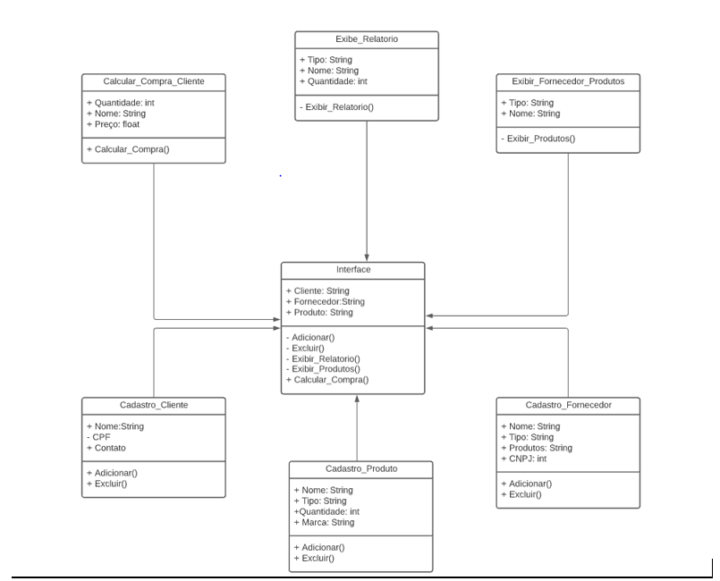

# Sistema de gerenciamento de estoque

Sistema de gerenciamento de estique, que visa os seguintes objetivos: 

* O sistema deve possibilitar o cadastro de clientes, fornecedores e produtos.
* O sistema deve exibir relatórios de clientes, fornecedores e produtos.
* O sistema deve exibir um relatório com todos os produtos de um fornecedor.
* O sistema deve exibir uma compra feita por um cliente, calculando o valor total da compra mediante a quantidade de produtos comprados.
 
## Sumário
- [Página do projeto](https://github.com/Rocky-WP/Rocky-WP.github.io)

- [Relatórios](#relatorios)

- [Diagrama de classe](#diagrama-de-classe)
  
## Relatórios

### Diagrama de classe

